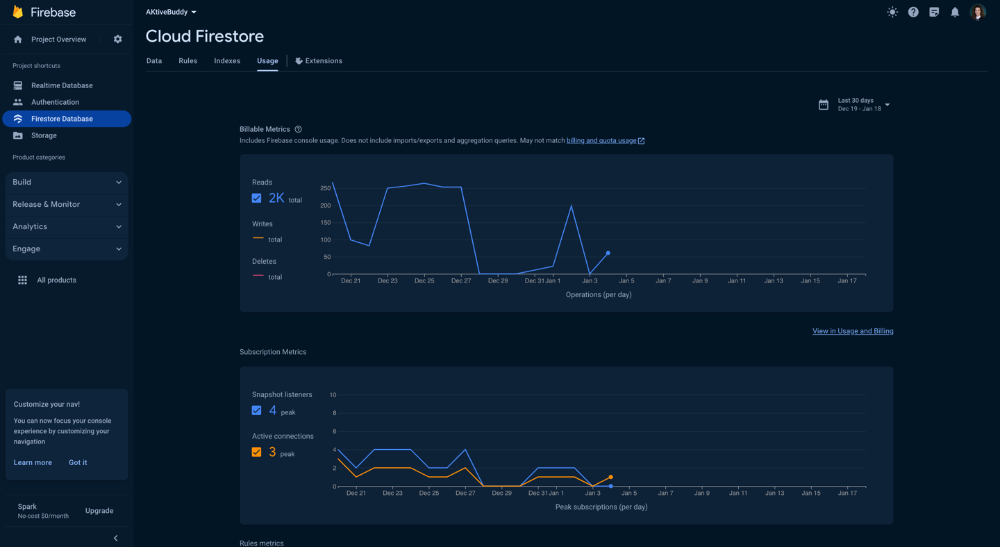

# [Firebase Firestore](https://firebase.google.com/docs/firestore)
**Firebase Firestore** je prilagodljiv, in razširljiv podatkovni sistem del Firebase-ove platforme, ki jo upravlja Google (deluje v oblaku).
Primeren je razvoj mobilnih, spletnih, in strežniških aplikacij.
Podobno kot Firebase Realtime Database ohranja sinhronizacijo podatkov med aplikacijami s pomočjo poslušalcev v realnem času in zagotavlja brezhibno delovanje brez povezave na mobilnih napravah in na spletu (predpomnilnik).
S tem omogoča ustvarjanje odzivnih aplikacij, ki delujejo ne glede internetno povezljivost.
Cloud Firestore prav tako omogoča brezhibno integracijo z drugimi izdelki Firebase in Google Cloud, vključno z oblakovo funkcionalnostjo.

Firebase Firestore lahko vključite v vaš projekt prek programa Android Studio (Orodja -> Firebase -> Cloud Firestore) ali s sledenjem korakom dokumentacije.

## Zakaj Cloud Firestore?

Cloud Firestore ima ključne sposobnosti, kot so:
1. **Prilagodljivost:** Shranjujte podatke v dokumentih, organiziranih v zbirke. Dokumenti lahko vsebujejo kompleksne gnezdene objekte poleg podzbirk.

2. **Izrazito poizvedovanje:** Uporabljajte poizvedbe za pridobivanje posameznih, določenih dokumentov ali za pridobivanje vseh dokumentov v zbirki, ki se ujemajo s parametri vaše poizvedbe. Poizvedbe lahko vključujejo več zaporednih filtrov in združujejo filtriranje ter razvrščanje. Privzeto so tudi indeksirane, zato je učinkovitost poizvedbe sorazmerna s velikostjo rezultatnega nabora, ne pa vašega podatkovnega nabora.

3. **Posodobitve v realnem času:** Kot pri storitvi Realtime Database uporablja Cloud Firestore sinhronizacijo podatkov za posodabljanje podatkov na kateri koli povezani napravi. Kljub temu je zasnovan tudi za učinkovito izvajanje preprostih / enokratnih poizvedb.

4. **Podpora brez povezave:** Cloud Firestore predpomni podatke, ki jih vaša aplikacija aktivno uporablja, tako da lahko aplikacija piše, bere, posluša, in poizveduje podatke tudi, ko je naprava brez povezave. Ko se naprava ponovno poveže, Cloud Firestore sinhronizira vse lokalne spremembe nazaj v storitev Cloud Firestore.

5. **Zasnovan za razširljivost**


## [Prednosti in slabosti](https://blog.back4app.com/firebase-advantages-and-disadvantages/)

| Prednosti :heavy_plus_sign:                          | Slabosti :heavy_minus_sign:                       |
|------------------------------------------------------|---------------------------------------------------|
| Realnočasno posodabljanje podatkov                   | Kompleksno ocenjevanje obračuna                   |
| Skalabilnost                                         | Omejena kompleksnost poizvedb                     |
| Enostavna integracija z drugimi storitvami Firebase  | Ni na voljo globalno                              |
| Fleksibilna shema podatkov                           | Uporaba in omejitve                               |
| Učinkovito iskanje in poizvedovanje                  | Omejeno na Google Cloud                           |
| Vgrajena varnost                                     | Manjka namenska strežniška in podjetniška podpora |
| Enostavna uporaba v mobilnih in spletnih aplikacijah | Odvisnost od storitve v oblaku                    |

## [Licenca](https://github.com/firebase)
Apache 2.0 licenca in MIT licenca

## Zanimivi podatki

Po svetu je leta 2023 več kot 1.159 podjetij začelo uporabljati Google Cloud Firestore kot orodje za NoSQL podatkovne baze. Podjetja, ki uporabljajo Google Cloud Firestore za NoSQL podatkovne baze, so večinoma iz Združenih držav, kjer ima 421 strank.
Zadnja posoobitev je bila 2.1.2024 (Podpora za lokaciji europe-west1 (Belgija) in me-central2 (Dammam)). Imajo redno posodabljanje - skoraj dvakrat mesečno.

## Gradle elementi

```gradle
plugins {
    id("com.google.gms.google-services")
}

dependencies {
    implementation(platform("com.google.firebase:firebase-bom:32.5.0"))
    implementation("com.google.firebase:firebase-firestore")
}
```

## Primer aplikacije
Firebase Firestore podatkovno bazo sem uporabila v demo aplikaciji, ki se nahaja v tem repozitoriju. Prav tako sem jo integrirala v drugo aplikacijo, ki sem jo razvijala kot vajo pri predmetu Platformno Odvisen Razvoj Aplikacij.
Na spodnji sliki je prikazano, kako sem uporabila to bazo, poleg tega sem predstavila tudi statistiko in uporabo podatkovne baze v moji aplikaciji.

### Phone book naloga (demo aplikacija)
**Zaslon, kje se pokažejo vse podatke iz bazo**

**Zaslona, kje se pokaže posamezen podatek**


**Zaslona, kje se pokaže spremembo podatek**


**Zaslona, kje se pokaže izbrisan padetek**


**Zaslona, kje se pokaže vnos novi padetek**


**Kodo, kje je napisana funkcija getContacts**

**Kodo, kje je napisana funkcija createConctact, removeConctat in editConctat**


### AKtiveBuddy naloga (druga aplikacija pri predmetu PORA)
**Zasloni, kje se pokažejo vse podatke iz bazo**


**Zaslon, kje je prikazan podatek v bazo**

**Kodo, kje je napisana funkcija addLocation**

**Kodo, kje je napisana funkcija getAllFitnessLocations**

**Kodo, kje je napisana funkcija addFitness**


### Google Console Firebase + statistika





